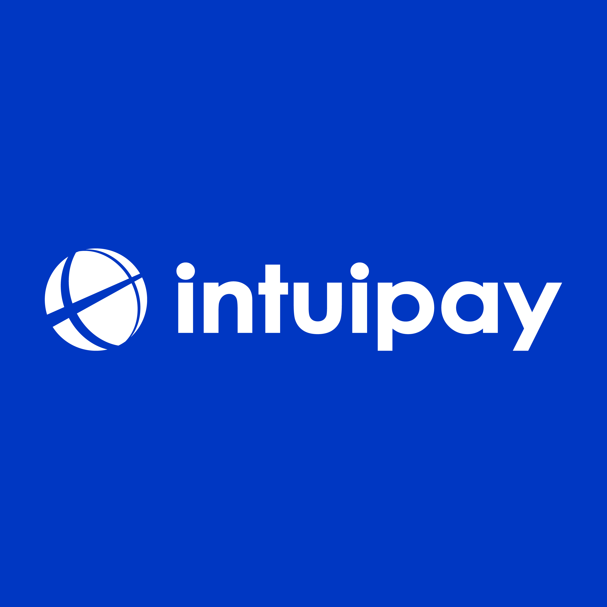
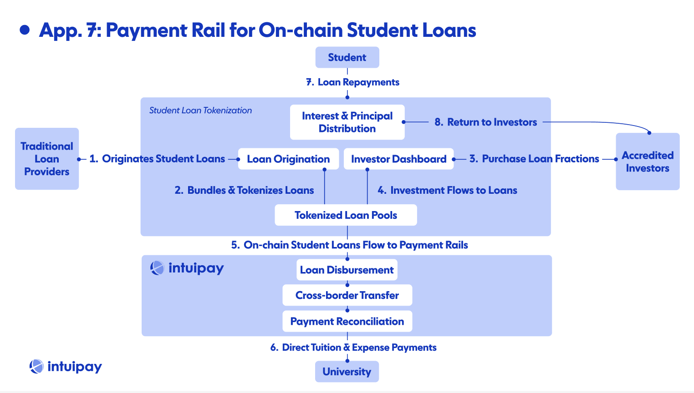

# Intuipay

*Pay international tuition faster, cheaper, smarter | live on Pharos Devnet*
- Project Link: [intuipay website](https://intuipay-website-v2.pages.dev/)
- Demo Video: [demo on youtube](https://youtu.be/8U1hZSKTWpg)
- Pitch Video: [pitch on youtube](https://youtu.be/NFpHrczG5nU)
- Deck: [pitch deck](https://docsend.com/view/ayesdiffahjr23jj)
- Github: [intuipay-v1](https://github.com/intuipay/intuipay-website-v2)
- Twitter: [@intuipay](https://x.com/intuipay)

 

## Cross-border Tuition Payment Remains Stuck While Global Remittance Undergoes Revolution

> "If SWIFT is the postal service, tokenization is email itself - assets move directly and instantly, sidestepping intermediaries." - Larry Fink (Founder & CEO, BlackRock)

 

## International Tuition Payments Are Broken

While global remittance continues to innovate and grow rapidly, the education segment has remained stagnant. There's little innovation since the early 2000s - the numbers speak for themselves. Parents and students who study abroad still have a undergo a lumbersome process and pay exorbitant fees (often without knowing it).

&nbsp;

For example, a Chinese student going to Emory University pay ~$73,000 per financial year. Banks and credit companies would charge up to 3-8% (processing fee, FX mark up, additional fee) to process the payment and settle in 3-7 business days. That's ~$5,840 per year per student for tuition alone. At a larger pciture, Emory University is home to nearly 3,300 international students, which translates to ~$19,270,000, or ~$19.3M just in fees from one university.

 

## Average remittance costs by funding instrument (% of transfer)

Average remittance costs via SWIFT (Society for Worldwide Interbank Financial Telecommunications), the most common method for international payment transfers, is ~8% as of december 2023. That of credit / debit card (lowest in the chart) is ~5.2%. This is a significant amount especially in high-volume / high-amount transfers like tuition / study-abroad situations where $80B+ flow, growing at 6+% YoY in and out each year.
&nbsp;
Source: Bloomberg, The World Bank, and Coinbase.

 

## A Massive, Growing Market Yet to be Captured

Among all the key corridors in the global market, Intuipay will focus on China (25%, 1.4M), India (29%, 1.6M) and their nearby countries / nations / regions. India and Greater China are the world's largest and fastest growing markets for education. It's important to note that both also have the history of investing heavily into education.

&nbsp;

While both markets are strict in terms of cross-border payment policies, there are methods to fulfill the requirements while being compliant. Being compliant could be a key barrier of entry and a long-term competitive advantage down the line.

 

## There’s No Border in Crypto

The comparison here is very clear: Intuipay is (1) faster, (2) cheaper, (3) more transparent & reliable, (4) easier to use, (5) available 24/7.

&nbsp;
Leveraging crypto's speed & cost efficiency while abstracting its complexity for mainstream users, intuipay is capable of becoming the global tuition payment standard.

 

## Simplified User Journey

The journey seems complicated but 90%+ happen only in the back-end, users from both ends have much simplier process compared to before. At a high-level:
1. User submits tuition payment
2. Payment method is processed
3. Funds are converted to USDC & routed
4. Funds are delivered to settlement
5. Local currency is converted & deposited to university
6. Payment completion is confirmed
7. Receipt & confirmation are displayed to user
   
&nbsp;
For parents / students, all blockchain complexity is hidden - students just see familiar payment methods and much faster and cheaper results.
For universities, not only is blockchain complexity hideen, they also receive funds faster with less overhead and fewer reconciliation issues.

 

## Layed Architecture

- **User Interface Layer**: Using walletconnect, MetaMask, Phantom for web3-native routes and integrating with traditional, regional / local payment methods like UPI, Alipay, Visa, Mastercard, etc.
- **Blockchain Layer**: Built on Pharos; will be a multi-chain project (EDU Chain, Solana, Stellar, etc.) to prevent blockchain downtime and minimize network congestion and fees
- **Custody & Security Layer**: Managed by Circle and Fireblocks
- **Conversion Layer**: (On & Off-ramp) Working with Circle; consider to work with MoonPay, Binance, OKX, and Stripe
- **Compliance Layer**: (KYC/AML) Considering Elliptic and Onfido

 

## Process Flow with Aggregator Engine & Direct Payment

The defacult system process flow uses an aggregator engine that optimizes for:
- Price calculation
- Speed estimation
- Security scoring
This engine connects user payments to university systems through blockchain technology.

 

## Process Flow with Reserve & Yield Generation

Alternative system process flow for regions with strict policies - instead of directly transfering, intuipay uses its reserve to provide liquidity during the transfers to enable instant settlements without undergoing complex processes upfront. This also serves as a stage 2 exploration where excess or early-stored tuition payments can be leveraged to generate yields.

 

## Differentiation from Established Players

The international tuition payment space is currently fragmented with solutions that fail to address the core issues of speed, cost, and transparency. IntuiPay stands out by leveraging blockchain technology in a way that's invisible to end-users while delivering tangible benefits. Unlike traditional banking wire transfers that take up to a week and charge 3-7% in fees, IntuiPay completes transactions in under an hour at roughly a third of the cost.

 

## Revenue Streams

IntuiPay's business model is designed to capture value from multiple stakeholders while remaining significantly more affordable than incumbent solutions. The primary revenue engine is a tiered transaction fee structure of 0.5-3% charged to students—notably lower than the 3-8% typically charged by banks and traditional payment providers. This sliding scale approach accounts for the large variation in tuition amounts across different countries and institutions, ensuring accessibility for students from developing economies while capturing appropriate value from high-dollar transactions.

 

## Establishing Key Partnerships to Validate Solution 

IntuiPay is establishing key partnerships across five essential categories that create a comprehensive ecosystem for revolutionizing international tuition payments:

**1. Blockchain Infrastructure Partners**:
Intuipay has partnered with Pharos, EDU Chain and Solana and in the process of onboarding Stellar. The foundations will provide critical technical foundation while subsidizing processing fees during the initial growth phase. This arrangement enables our headline 0% processing fee offer to early adopters without sacrificing revenue, creating a powerful customer acquisition tool that traditional payment providers cannot match.

**2. On/Off-Ramp Partners**:
Intuipay has onboarded Circle as a partner, leveraging USDC, the institution-ready stablecoin, and its on- and off-chain network to effectively eliminate the traditional friction and costs associated with converting between fiat and digital currencies. This removes a significant barrier to adoption by making the crypto components completely invisible to end users.

**3. Institutional Credibility Partners**:
To establish institutional legitimacy, we are in the process of establishing partnerships with projects such as Visa, Mastercard, Unionpay, Standard Chartered, HSBC, etc. These relationships are particularly crucial for reassuring risk-averse stakeholders like university administrators and concerned parents who might otherwise hesitate to adopt a blockchain-based solution for large financial transactions.

**4. Showcase University Partners**:
The cornerstone of our market entry strategy is our showcase university partnerships with institutions like Emory, Wharton, and NTU Singapore. These relationships provide credible, real-world demonstrations of our system's effectiveness, with each partnership carefully selected to represent different geographic regions and student demographics.

**5. Distribution Partners**:
Our distribution partnerships with trusted student-facing organizations—including major study abroad agencies and international student associations—create organic growth channels by leveraging existing trust relationships. Rather than building credibility from scratch, these partnerships allow us to tap into established networks where payment recommendations carry significant weight.

Together, these interconnected partnerships create a foundation for rapid growth while addressing the key concerns of all stakeholders in the international education payment journey.

 

## Logical Extensions to Explore: Payment Rail for On-chain Student Loans

One of the primary use cases for Intuipay is serving as payment rails for onchain student loans. After student loans are tokenized and students raise funds for their tuition and living expenses, the funds stay onchain and require an intuitive channel to process and off-ramp - intuipay serves as the optimal channel.
